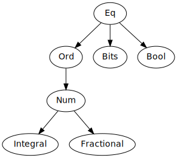

# Kyllini Language User Guide

This document discusses the kyllini dialect of Ziria. Since it is strictly more
expressive than the classic dialect, we expect it to be used for all new
development. Files containing kyllini source code end in `.kz`.

Kyllini is at its core a pure, functional language. However, the syntax "looks"
imperative, and when writing Kyllini, you can treat it as a standard, imperative
language. The underlying purity does occasionally leak through—for example, in
Kyllini's `return` construct.

## Kyllini by example

Here is the scrambler example, adapted from the original Ziria language tutorial
and rewritten in Kyllini:

```haskell
fun scrambler() {
  let mut scrmbl_st : [bit;7] = ['1,'1,'1,'1,'1,'1,'1];
  let mut tmp : bit;
  let mut y :bit;

  repeat {
    x <- take;

    tmp = (scrmbl_st[3] ^ scrmbl_st[0]);
    scrmbl_st[0:5] = scrmbl_st[1:6];
    scrmbl_st[6] = tmp;
    y = x ^ tmp;
    print y;

    emit y;
  }
}

let comp main : ST T bit bit = scrambler();
```

The scrambler declares three **mutable** variables, `scrmbl_st`, `tmp`, and `y`.
The first of these, `scrmbl_st`, is initialized to the bit array of length 7
containing all ones. All three declarations have a type signature, which is
optional when the type of a binding can be inferred from its right-hand side.
The type signature for `scrmbl_st` is of the form `[TYPE;LEN]`, which is an
array of length `LEN` containing elements of type `TYPE`.

After declaring local variables, `scrambler` executes a `repeat` statement,
which causes the body of the `repeat` to be repeatedly executed forever. The
body:
 1. `take`s a value from its input.
 2. Performs some imperative computation to produce `y`.
 3. Writes `y` to its output.

Input and output constructs, like `take` and `emit`, are built-in to the
language. Every Kyllini program is a stream processor, and so is reading input
and producing output. The top-level `main` computation specifies how the overall
Kyllini program operates. Here, it simply calls `scrambler`. Note the type
signature on `main`, `ST T bit bit`. This type signature signifies that `main`
is a **stream transformer** that reads bits from its input and writes bits to
its output.

## Variable bindings

Variable bindings are introduced with `let`:

```haskell
let x = 5;
```

The type of a binding will be inferred by the compiler, but the programmer can manually annotate a binding with a type signature as follows:

```haskell
let x : int = 5;
```

A `let` binding is **immutable**. To create a **mutable** binding, use the `let
mut` declaration form:

```haskell
let mut x = 5;
```

A declaration of a mutable binding may optionally have a type signature. It may
also optionally have an initializer; in our example above, `x` was initialized
to the value `5`. If not initializer is provided, the memory allocated for the
mutable binding will be zeroed.

## Functions

Functions are declared using the `fun` keyword:

```haskell
fun print_sum(x: i32, y: i32) {
    println "sum is: ", x, y;
}
```

A function may have zero or more parameters, whose type signatures are optional.

A function may also be annotated with a return type:

```haskell
fun print_sum(x: i32, y: i32) -> () {
    println "sum is: ", x, y;
}
```

As with `let` bindings, function parameters are immutable. A parameter may be declared mutable with the `mut` keyword:

```
fun sum(x: i32, y: i32, mut z : i32) {
    z = x + y;
}
```

Functions are called with the usual syntax.

TODO

 * External functions:

```
fun external sum(x: i32, y: i32) -> i32;
```

## Primitive Types

Kyllini has a special `bit` type, with constant values `'0` and `'1`.

```
let x : bit = '1;
```

The following numeric types are available:

 * `int`
 * `int8`
 * `int32`
 * `int16`
 * `iN`
 * `uint`
 * `uint8`
 * `uint32`
 * `uint16`
 * `uN`
 * `qM_N`
 * `qN`
 * `uqM_N`
 * `uqN`
 * `float`
 * `double`
 * `f32`
 * `f64`

The type `bit` is equivalent to the type `u1`.

The `iN` and `uN` types allow for arbitrarily-sized signed and unsigned integral
types.

The `qM_N`, `qN`, `uqM_N`, and `uqN` types are fixed-point types.

All floating-point values are IEEE-754. The `f32` and `f64` types are equivalent to `float` and `double`, respectively.

### Fixed-point types

The type `qM_N` is a signed fixed-point type with an `M`-bit integral part and
`N`-bit fractional part. The type `qM_N` therefore requirs M+N+1 bits to
represent, since a sign bit is also needed. The type `qN` is a signed
fixed-point number with `N` fractional bits. The `uqM_N` and `uqN` types are the
corresponding *unsigned* fixed-point types. Note that `uqM_N` requires only M+N
bits to represent since it does not need a sign bit. The numbers `M` and `N`
must be positive integers—it is not possible to write `q8_0` as a synonym for
`i8`.

### Other base types

Kyllini includes the unit type, `()`. The only value of this type is `()`. It
also includes the Boolean type `bool` with values `false` and `true`.

### Struct declarations

A struct can be declared as follows:

```
struct Point { x : int, y : int }
```
Fields are comma-separated and must be given a type.

### Type aliases

Type aliases may be declared using the `type` keyword:

```
type myint = int16;
```

## Loops

Besides the `repeat` loop we saw in the scrambler example, kyllini supports `for`, `while`, and `until` loops.

The `while` and `until` loop constructs execute a body predicated on a conditional:

```
let mut y = 0;

while (y > 0) {
  x <- take;
  y = x;
}
```

A `for` loop executes its body a fixed number of times. Unlike C, loop bounds
are explicit and the programmer does not provide a test. Loop bounds are **exclusive**, so the following loop body is executed 10 times with the variable `i` ranging from 0 through (and including) 9.

```
for i in 0..10 {
  x <- take;
  emit id(x);
}
```

## Arrays

Arrays are written by listing comma-separated values between square brackets, for example:

```
let x = [1, 2, 3, 4, 5];
```

Array indexing uses standard notation. Kyllini also supports array slices. For
example, the expression `xs[2:5]` returns items 2 through 5, inclusive, of the
array `xs`.

## Structs

Struct values can be written in the following two, equivalent ways:

```
struct Point { x : int, y : int }

let x = Point { x = 0, y = 0 };
let y = struct Point { x = 0, y = 0 };
```

## Expressions

### Operators

| Operator | Precedence | Associativity |
|-|-|
| `&&` <code>&#124;&#124;</code> | 1 | left |
| `==` `!=` | 2 | left |
| <code>&#124;</code> | 3 | left |
| `^` | 4 | left |
| `&` | 5 | left |
| `<` `<=` `>` `>=` | 6 | left |
| `<<` `>>` | 7 | left |
| `+` `-` | 8 | left |
| `*` `/` `%` | 9 | left |
| `**` | 10 | left |
| `length` | 11 | left |
| `~` `not` (unary) `-` | 12 | left |

### Casting

There are two forms of casts: coercion casts, and bit casts. Bit casts can only
casts between types with the same bit size. Coercion casts take one of
two equivalent forms:

```
<simple-type> '(' <exp> ')'
'cast' '<' <base-type> '>' '(' exp ')'
```

Bit casts take the form

```
'bitcast' '<' <base-type> '>' '(' exp ')'
```

#### Auto-casting

Coercion casts between types are automatically inserted to, e.g., ensure that
the arguments to binary operators have the same type. The following rules govern
automatic casts inserted by the front end:

 * Integer constants are always cast to match the other types.
 * Floating-point constants are always cast to match the other type *if* it has the `Fractional` trait, i.e., if it is a floating-point or fixed-point type.
 * Integer and fractional types are always widened and made signed if necessary.
 * Types crawl up the lattice from integral to fixed-point to floating point. That is, integer types are cast up to fractional types, which are cast up to floating-point types.

## Stream processors

Stream processors are built from the following basic constructs:

 1. `take` consumes a single value from a stream.
 1. `take N` consumes `N` values from a stream and returns them in an array. `N` must be an integer constant.
 1. `emit <e>` produces the value of `<e>` on a stream's output.
 1. `emits <e>` produces the value of `<e>` on a stream's output, which must be an array. This is equivalent to calling `emit` individually on the elements of `<e>`, but more efficient.
 1. `repeat <s>` repeats `s` forever.

TODO:

 * `>>>` and `|>>>|`

## Generics

Kyllini is a fully polymorphic language supporting generics. Polymorphism is inferred. For example, we can write the identity function as follows:

```haskell
fun id(x) {
  return x;
}
```

It is also possible to **explicitly** indicate that a function is polymorphic
using Rust-style generics. In the following code, we quantify over the type `T`.

```haskell
fun id<T>(x : T) {
  return x;
}
```

Struct declarations can also be polymorphic. For example:

```haskell
struct Point<T> { x : T, y : T }
```

### Type classes/traits

Kyllini supports Haskell-style type classes (or Rust-style traits, if you prefer
to think of it that way). This allows type variables to be constrained. There is
a fixed type class hierarchy:



| Type | Classes |
|---|---|
| Unit `()` | Eq |
| `bool` | Eq, Ord, Bool |
| `bit` | Eq, Ord, Bool, Bits |
| Unsigned integral types width > 1 (`uint`, `uint8`, etc.) | Eq, Ord, Num, Integral, Bits |
| Signed integral types (`int`, `int8`, etc.) | Eq, Ord, Num, Integral |
| Floating types (`float`, `double`, `f32`, `f64`) | Eq, Ord, Num, Fractional |

If a type variable is left unconstrained, its constraints will be inferred. For example, we can write the polymorphic increment function as follows, as its type will be inferred as `<T:Num>(T) -> T`:

```haskell
fun inc<T>(x : T) {
  return x + 1;
}
```

We could also explicitly annotate the type variables `T` with the `Num` trait.

```haskell
fun inc<T : Num>(x : T) {
  return x + 1;
}
```

Finally, we can also annotate type variables in struct declarations with traits:

```haskell
struct Point<T : Fractional> { x : T, y : T }
```

### The `Complex<T>` type

Kyllini has a built-in generic data type, `Complex<T : Num>`, and type aliases
that specialize the `Complex` type to various widths. That is, the compiler
behaves as if the following definitions are always available:

```
struct Complex<T : Num> { re : T, im : T }

type complex   = Complex<int>;
type complex8  = Complex<int8>;
type complex16 = Complex<int16>;
type complex32 = Complex<int32>;
type complex64 = Complex<int64>;
```

If `T` has traits `Eq`, `Ord`, or `Num`, then `Complex<T>` also has the
corresponding traits, i.e., `Complex<T>` "inherits" the traits `Eq`, `Ord`, and
`Num`—but no others—from `T`.

## Differences with respect to classic Ziria

The `kzc` compiler supports two dialects or Ziria (technically three): the
classic dialect, and the kyllini dialect. The classic dialect comes in "lenient"
and "strict" flavors. The lenient flavor is the default—the strict flavor can be
enabled with the `-fstrict-parse` flag.

Both flavors of the classic dialect are almost completely compatible with the
original Ziria compiler, with the following minor differences:

 1. The `complex` and `complex32` types are distinct in the classic dialect, but not in the original Ziria compiler.
 1. The `int` and `int32` types are distinct in the classic dialect, but not in the original Ziria compiler.
 1. The classic dialect allows external functions to be marked `impure`. By default, external functions are assumed to be pure. The original Ziria compiler doesn't make a distinction between pure and impure external functions.

The lenient flavor further differs in the following ways:

 1. Type signatures on bindings are optional.
 1. Function bindings can have an optional type signature using the syntax `: TYPE`.
 1. The `seq`/`do` distinction is completely eliminated.

The only reason to use the strict flavor of classic dialect is if you are
developing new code that must be compatible with the original Ziria compiler.
